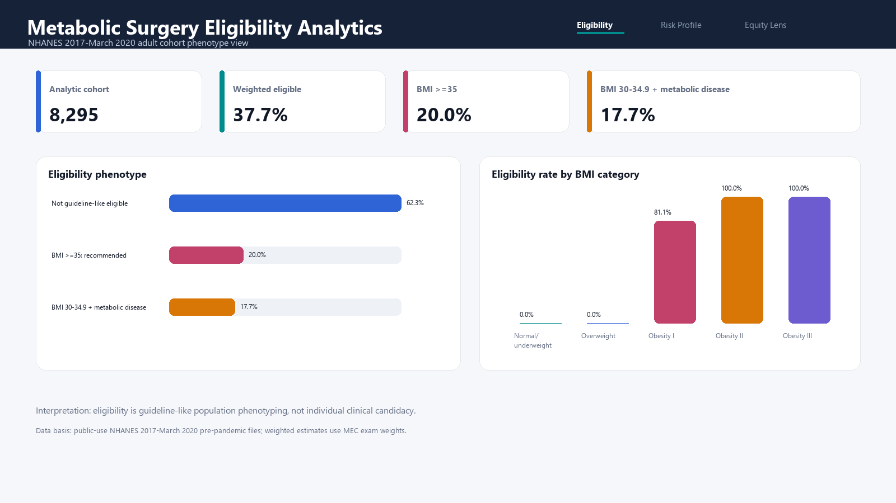

# Metabolic Surgery Eligibility and Cardiometabolic Risk Analytics

Python, SQL, and Power BI portfolio project using public-use NHANES 2017-March 2020 pre-pandemic data. The project demonstrates clinical cohort phenotyping, guideline-like metabolic surgery eligibility logic, cardiometabolic risk engineering, survey-weighted reporting, SQL validation, and dashboard-ready outputs.

## Project Question

Among U.S. adults in NHANES 2017-March 2020, who meets guideline-like metabolic surgery eligibility criteria, and what cardiometabolic risk burden is present among eligible vs non-eligible groups?

## Why This Project Matters

This is a clinical analytics project rather than a generic dashboard. It translates public survey, exam, questionnaire, and laboratory data into a defensible analytic cohort with clear denominators, phenotype definitions, and interpretation limits.

The analysis is based on the 2022 ASMBS/IFSO indications framing: metabolic and bariatric surgery is recommended for BMI >=35 kg/m2 and should be considered for BMI 30-34.9 kg/m2 with metabolic disease. This project uses those thresholds for population-level phenotyping only; it does not determine individual clinical candidacy.

Primary sources:

- CDC/NCHS NHANES: https://www.cdc.gov/nchs/nhanes/
- NHANES 2017-March 2020 pre-pandemic files: https://wwwn.cdc.gov/nchs/nhanes/search/datapage.aspx?Cycle=2017-2020
- 2022 ASMBS/IFSO indications: https://asmbs.org/resources/2022-asmbs-and-ifso-indications-for-metabolic-and-bariatric-surgery/



Additional report previews:

- [Eligibility Overview](assets/powerbi-page-1-eligibility-overview.png)
- [Cardiometabolic Risk Profile](assets/powerbi-page-2-risk-profile.png)
- [Equity Lens and Cohort Audit](assets/powerbi-page-3-equity-audit.png)

## Headline Results

| Metric | Result |
| --- | ---: |
| Analytic cohort adults | 8,295 |
| Weighted guideline-like eligibility rate | 37.7% |
| Weighted BMI >=35 recommended rate | 20.0% |
| Weighted BMI 30-34.9 + metabolic disease rate | 17.7% |
| Weighted mean BMI among eligible adults | 36.9 kg/m2 |
| Eligible adults with 2+ cardiometabolic risk signals | 91.5% |

Among guideline-like eligible adults, weighted risk-signal prevalence was 23.3% for diabetes or A1c diabetes range, 70.3% for hypertension or treatment, 74.7% for dyslipidemia signal, and 93.9% for central adiposity signal.

## What This Project Demonstrates

- Public clinical survey data ingestion from NHANES XPT files.
- Multi-table joins across demographics, body measures, blood pressure, labs, and questionnaires.
- Adult analytic cohort construction with pregnancy exclusion for BMI-based phenotyping.
- Clinical feature engineering for BMI class, diabetes signal, hypertension signal, dyslipidemia signal, central adiposity, and risk burden.
- Guideline-like metabolic surgery eligibility classification.
- Survey-weighted descriptive reporting using MEC exam weights.
- SQLite validation of key denominators and weighted metrics.
- Power BI-ready reporting tables and reference report pages.

## Repository Structure

```text
.
├── .github/
│   └── workflows/
│       └── tests.yml
├── assets/
│   ├── dashboard-preview.png
│   ├── powerbi-page-1-eligibility-overview.png
│   ├── powerbi-page-2-risk-profile.png
│   └── powerbi-page-3-equity-audit.png
├── data/
│   ├── processed/
│   └── raw/
├── docs/
│   ├── DATA_DICTIONARY.md
│   ├── DATA_SOURCE_AND_VALIDATION.md
│   ├── METHODS.md
│   └── POWERBI_BUILD_GUIDE.md
├── pipeline/
│   ├── 04_sql_validation.sql
│   ├── build_nhanes_metabolic_surgery_dataset.py
│   ├── build_sqlite_database.py
│   ├── create_powerbi_previews.py
│   ├── run_sql_validation.py
│   └── README.md
├── powerbi/
│   ├── measures.dax
│   └── theme-metabolic-surgery.json
├── reports/
│   └── ANALYST_BRIEF.md
├── requirements.txt
└── tests/
    └── test_pipeline_outputs.py
```

## Run

```bash
pip install -r requirements.txt
python pipeline/build_nhanes_metabolic_surgery_dataset.py
python pipeline/build_sqlite_database.py
python pipeline/run_sql_validation.py
python pipeline/create_powerbi_previews.py
python -m unittest discover -s tests -v
```

The first pipeline run downloads public-use NHANES XPT files into `data/raw/`. Raw XPT files are not tracked in Git; processed dashboard-ready outputs are tracked.

## Key Outputs

- `data/processed/analytic_cohort.csv`
- `data/processed/dashboard_kpis.csv`
- `data/processed/eligibility_summary.csv`
- `data/processed/cardiometabolic_risk_summary.csv`
- `data/processed/eligibility_by_age_group.csv`
- `data/processed/eligibility_by_sex.csv`
- `data/processed/eligibility_by_race_ethnicity.csv`
- `data/processed/eligibility_by_bmi_category.csv`
- `data/processed/missingness_summary.csv`
- `data/processed/sql_validation_summary.csv`
- `reports/ANALYST_BRIEF.md`

## Power BI

Use `docs/POWERBI_BUILD_GUIDE.md` with:

- `data/processed/*.csv`
- `powerbi/measures.dax`
- `powerbi/theme-metabolic-surgery.json`
- reference previews in `assets/`

The recommended report has three pages:

1. Eligibility Overview
2. Cardiometabolic Risk Profile
3. Equity Lens and Cohort Audit

## Data Scope

This project uses public-use, de-identified NHANES survey data. It contains no real patient identifiers, no PHI, no MIMIC-IV data, and no restricted clinical source data.

## Interpretation Boundary

The project is a reproducible analytics demonstration. It should not be interpreted as medical advice, individual surgical candidacy determination, causal inference, or real-world operative outcome evidence.
